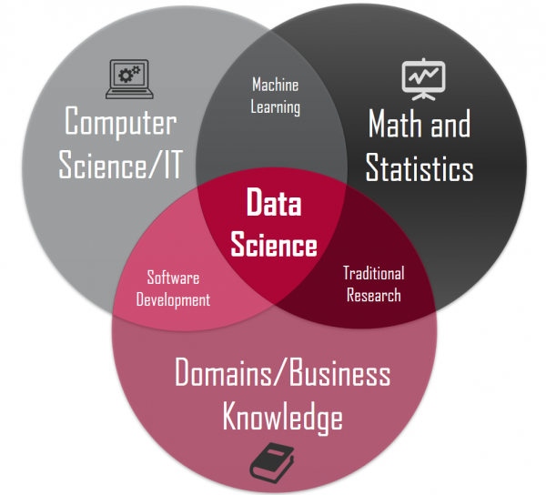

# Introducción 

Bienvenidas y bienvenidos a *Introducción a R para el Análisis de Datos en Psicología*. Este curso tiene como principal objetivo de aprendizaje que el lector adquiera y desarrolle habilidades básicas de programación usando el lenguaje R para realizar análisis de datos en psicología. Primero que todo, me gustaría decir que para usar R no hace falta ser un experto en programación, poseer conocimientos superlativos y una memoria sinigual. Para eso existen las opciones de ayuda de RStudio (ya veremos en qué consiste) y el vasto universo de contenidos que habita en *google*. Mucho mejor es utilizar nuestros recursos cognitivos en conceptualizar y descomponer adecuadamente los pasos del análisis que llevaremos a cabo, y de resolver dichos desafíos flexiblemente a través de R. Después de muchas horas interactuando y leyendo un montón de recursos (libros, blogs, videos en internet, cursos presenciales y online de R, conversaciones con colegas y amigos), me he dado cuenta que cualquier persona con la motivación y algo de tiempo puede aprender a usar R de manera bastante competente para el análisis de datos. 

Comencé a aprender a programar utilizando R y Python (otro popular lenguaje de programación que, entre muchas cosas, sirve para el análisis de datos) a mediados de 2019. Obviamente, lo sigo aprendiendo día a día porque ambos lenguajes son universos inagotables y con fronteras en continua expansión gracias a sus mismos usuarios. Como la gran mayoría de personas que empiezan el camino del análisis de datos usando lenguajes de programación, en un comienzo estaba perdido, no entendía por donde tenía que comenzar, o por qué tenía que aprender un montón de términos como *programación orientada a objetos*, *atributos*, *entorno de desarrollo integrado*, etc. Mirando en retrospectiva, este recurso online hubiera sido bastante útil para mi yo del pasado, considerando sobretodo mi formación y conocimientos en psicología. Para los no psicólogos o aquellos aún poco familiarizados con la disciplina, en un número importante de programas de estudios de pregrado y postgrado, no se contempla el aprendizaje de lenguajes de programación para el análisis de datos. De este modo, me parece que un libro de fácil lectura sobre R, basado en casos, problemas y/o investigaciones psicológicas, que entregue herramientas básicas para comenzar a ensuciarse las manos con el análisis de datos, es una muy buena idea y una excelente forma de invertir nuestro tiempo 🤓. 

## ¿Por qué Programar en R?

Antes de seguir adelante, quizás la primera pregunta que deberíamos responder es: ¿por qué debería aprender a programar en R? No es una pregunta fácil de contestar, pero trataré de responderla tomando en cuenta lo que dicen algunos textos especializados sobre el tema y también a partir de mi propia experiencia. Probablemente, las razones más comunes son porque R es gratis y de acceso abierto. Gratis es un concepto bastante auto explicativo y no es necesario ahondar en él (solo mencionar que R seguirá siendo gratis *per saecula saeculorum*, es decir, para siempre). Acceso abierto o de código abierto es algo menos obvio, pero fácil de entender. Simplemente significa que cualquier persona en el mundo puede contribuir a su desarrollo. Contrasta con lenguajes cerrados (comúnmente de uso comercial como *Windows* de Microsoft) en los cuales las personas no pueden libremente acceder al código base y de este modo contribuir a su desarrollo. 

¿Esto significa que el desarrollo de R depende de personas con un gran espíritu prosocial que están dispuestas a desarrollar herramientas para que otros puedan utilizarlas sin pagar un solo peso, dólar, euro o libra? La respuesta es un sólido: ¡Sí! Espera un momento. Esto suena demasiado bueno para ser verdad. Algunos podrían reparar que esta manera de funcionamiento dejaría a R a disposición de un grupo reducido de personas, quienes trabajarían, desinteresadamente en estos proyectos, pero solo cuando tuvieran tiempo y, por lo tanto, que su desarrollo sería un proceso bastante lento, repleto de errores y poco confiable. Afortunadamente para nosotros, la comunidad de R es bastante extensa (literalmente miles de personas alrededor del mundo), y existen más de 16,000 librerías de análisis de datos disponibles en R y, en general, son bastantes confiables. Como uno podría esperar, hay librerías más maduras que otras, y que estas últimas ya forman parte del flujo de trabajo cotidiano de muchos analistas de datos en el mundo (como por ejemplo las librerías `dplyr` y `ggplot2`, las cuales forman parte del `tidyverse`). ¡El trabajo de la comunidad de R saca a relucir lo mejor de la humanidad!


```{=html}
<p align="center">
  
</p>
<p align="center">
Figura 1. Ilustración de la comunidad de R interactuando en el mundo virtual.
</p>
```

Otra razón para utilizar R obedece al espíritu de nuestro tiempo, específicamente, al creciente interés a nivel internacional en la ciencia de datos o *data science*. Probablemente, en más de una ocasión han visto en algún sitio de la internet o en las noticias hablar sobre ciencia de datos.  Hay una considerable oferta de cursos, diplomados o postgrados ofreciendo especializaciones en ciencia de datos, la cual fue catalogada como el trabajo más sexy del siglo XXI (Davenport & Patil, 2012). Si bien no existe una definición unánime al respecto, me gusta bastante la conceptualización ofrecida por Conway (2010), quien la entiende como el solapamiento o superposición de tres dominios: el conocimiento matemático y estadístico; habilidades de hacker o de programación, por ejemplo, usando R o Python; y el conocimiento especializado (en nuestro caso sobre fenómenos psicológicos). Desde este punto de vista, los científicos de datos no se articulan como una nueva disciplina científica en sí misma, pero sus habilidades son claves para entender, el muchas veces, desestructurado entorno que nos rodea. 

```{=html}
<p align="center">
  
</p>
<p align="center">
Figura 2. Diagrama de Venn ilustrando los dominios de solapamaniento de la ciencia de datos.
</p>
```

Asimismo, esta forma de entender la ciencia de datos aplicadas a dominios de conocimientos específicos es consistente con otra visión que ha calado profundamente en el quehacer analítico: la ciencia de datos constituye un cambio de cultura sobre el análisis de datos. Si bien *softwares* como el famoso *statistical package for the social sciences* (SPSS) han cambiado la forma en que psicólogos y muchos profesionales de las ciencias sociales se aproximan al análisis estadístico, la capacidad de escribir código es absolutamente fundamental para controlar e ir más allá en todas las etapas del análisis de datos, como la exploración, la visualización, la modelización y la comunicación de los resultados, por nombrar solo algunas. Incluso, algunos sostienen que es imposible hacer ciencia de datos hoy en día sin saber programar 😱, y yo diría que se vuelve muy difícil hacer investigación en cualquier dominio disciplinar sin tener un mínimo conocimiento en programación. 

## Estructura del Presente Curso

Me gustaría tomarme un breve momento para describir y explicar brevemente los capítulos de este curso. Luego de la introducción, el capítulo 2 se titula “R en Acción”, el cual presenta un número importante de funciones que se utilizan muy frecuentemente en la exploración y descripción de base de datos reales. El principal objetivo de esta sección es que el lector pueda observar y seguir, de manera relativamente sencilla, lo que R es capaz de hacer con solo algunas líneas de código. He preferido situar estos contenidos de manera temprana en el curso por sobre una guía paso a paso de cómo instalar R y RStudio en nuestros computadores, cuyas instrucciones se pueden encontrar en el capítulo 3. Mi intención fue que las personas pudieran rápidamente seguir, escribir y/o ejecutar comandos simples para obtener resultados en una base de datos real. Creo que esta forma de ordenar los contenidos podría involucrar rápidamente a los lectores del curso en el mundo de la programación en R y contribuir a incrementar los niveles de motivación. En esta línea, he tratado de incluir tanto como he podido, ejercicios simples, pero útiles, a lo largo de las secciones de este recurso. 

En el capítulo 3, están descritos paso a paso cómo instalar el lenguaje de programación R en diferentes sistemas operativos. De manera muy rápida, evito describir la consola de R (la cual está incluida en la instalación de R) y paso directamente a hablar sobre RStudio y sus principales paneles y funcionalidades debido a que ésta es la herramienta que usaremos a lo largo de este curso para interactuar con R. Aquí hablaremos de la consola de RStudio, el panel de código o de *script* y, finalmente, me centraré en describir y explicar qué son los *R Notebooks* porque es una de las maneras más eficientes de hacer análisis de datos. Luego en el capítulo 4, reviso los comandos básicos de R, el cual ayudará a entender y familiarizarse con la lógica de funcionamiento de R y por qué ciertas instrucciones se ingresan de tal manera. Allí describiremos los símbolos de las operaciones matemáticas de R, junto con señalar cómo se crean variables y algunas reglas, tanto explicitas como implícitas, sobre la etiquetación de variables. También echaremos un vistazo a qué son las funciones, sus partes principales como uno de los elementos básicos de R: los vectores. 

El capítulo 5 explica de forma breve y general qué son y cómo instalar librerías o paquetes en R. Dichas extensiones son claves para aumentar las funcionalidades y simplificar los análisis de datos en R. A continuación, en el capítulo 6 me centraré en describir uno de los paquetes de análisis de datos más usados en el mundo de R: el tidyverse. Esta librería trae un conjunto de paquetes que son muy conocidos y frecuentemente utilizados tanto en la academia como en la industria. Probablemente, conocer para qué sirven estas librerías es prácticamente un deber en el mundo del análisis de datos global de hoy en día. Cualquier trabajo que requiera en su perfil de cargo el conocimiento y uso de R, casi con toda seguridad, solicitará la ejecución del análisis de datos a través de librerías del tidyverse. Lamentablemente, no ofreceré una descripción extensa de todos los paquetes que forman parte del tidyverse debido a que eso es explicado, de mejor manera, en otros recursos ya existentes y excede con suma lo que puede ser cubierto en este texto introductorio. No obstante, aspiro a presentar y encaminar al lector sobre cómo enfrentarse a las diferentes funcionalidades y necesidades que pueden ser satisfechas a través de este conjunto de librerías. Finalmente, en el capítulo 7 el lector encontrará un glosario con los términos técnicos de R que son trabajados y mencionados con cierta recurrencia en este curso. 

De este modo, este recurso puede verse como una introducción gentil al análisis de datos a través de la utilización de R para psicólogos (aunque puede ser usado por quien esté interesado independientemente de su profesión o quehacer) o como un curso, frecuentemente llamado, de “primeros pasos en R”. 


## Obstáculos en el Aprendizaje de R

Hemos revisado someramente algunas de los principales atributos de R y la estructura de este curso, pero no hemos dicho nada acerca de los obstáculos de este lenguaje. Me gustaría mencionar dos. El primero es que la forma de interactuar con R es a través de código, es decir, necesitamos escribir instrucciones en R para que el computador realice ciertas operaciones. Hoy en día, muchos de nosotros estamos súper acostumbrados a interactuar con sistemas donde clicamos o tocamos con nuestros dedos ciertas opciones y el dispositivo nos devuelve un resultado u *output*. Esta interfaz no es tan común en R, por lo que nos veremos obligados a aprender a escribir código para hacer cosas, más específicamente, análisis de datos. Esto esta íntimamente relacionado con la segunda limitante de R, la cual tiene que ver con que los nuevos usuarios les tomarán un tiempo aprender cómo comunicarse con R y acostumbrarse a este proceso. Es mejor ser claros y honestos en este punto: muchas veces tendrán que pasar algunas horas aprendiendo a escribir código para hacer algo muy sencillo (como por ejemplo cambiar el nombre de algunas variables). En esta etapa, se sentirán altamente tentados de ir a otro programa como Microsoft Excel y hacerlo manualmente ahí porque es mucho más sencillo (a mi me ha pasado muchas veces). Mi consejo es que resistan dicho impulso y traten de realizar dichas modificaciones en R. Aunque les llevará más tiempo al principio del proceso de aprendizaje, y muchos mensajes de frustrantes errores también (tomen aire y dense un pequeño tiempo fuera de ser necesario), luego dicho esfuerzo pagará sus dividendos. No obstante estas debilidades, creo que las ventajas de aprende a usar R sobrepasan con creces los costos. Después de todo, tendrán en su computador personal una de las herramientas más poderosas de análisis de datos del mundo, sin pagar un solo peso, dólar u euro demás. 

## Consideraciones Finales

Para escribir este curso en R me he basado en una amplia variedad de recursos, pero me gustaría explícitamente citar dos libros online y gratuitos debido a su calidad, filosofía y también de otorgarles el debido crédito. El primero de ellos es [**Learning Statistics with R**](https://learningstatisticswithr.com/book/){target="_blank"}  escrito por Danielle Navarro y [**R for Data Science**](https://r4ds.had.co.nz/){target="_blank"}  elaborado por Hadley Wickham y Garrett Grolemund. Ambos son excelentes recursos que han influido enormemente en un amplio número de científicos de datos y estudiantes de psicología mundialmente. El presente curso de R no hubiera sido posible sin la consulta frecuente de estos dos excelentes recursos. Invito a los lectores a clicar los hipervínculos de cada libro para que indaguen con más detalle en ellos y puedan ir mas allá de los contenidos aquí enseñados. Será un tiempo personal muy bien invertido. 

No existe un solo recurso, curso o libro que les enseñe a utilizar eficientemente R para cualquier tipo de problema que vayan a encontrar en el futuro. Usar competentemente R es un viaje que probablemente no tenga término. Con absoluta seguridad, no bastará con leer y usar el código de este curso. Resolver sus desafíos específicos requerirá consultar otros recursos y con mucha seguridad buscar en google líneas de códigos que hagan más fácil resolver sus propias necesidades. Este curso aspira a ser una introducción amistosa en el comienzo de aprendizaje de la utilización de este lenguaje de programación para el análisis de datos. 

¿Qué debe saber el lector para sacar el mejor provecho a este curso? Conocimientos básicos sobre estadística como por ejemplo saber la distinción entre análisis descriptivos e inferenciales, probabilidad y contraste de hipótesis. 

Con la liberación de los contenidos de este curso, también me gustaría contribuir a la formación de psicólogas y psicólogos, y de todas aquellas personas interesadas que están ubicadas más allá de las fronteras de disciplina de las ciencias psicológicas. Finalmente, este curso también se enmarca en las diferentes maneras de retribución (no obligatoria) de conocimientos y habilidades que he adquirido a lo largo de los años como resultado de mis estudios de postgrado en el extranjero de Magister y Doctorado, financiados por el gobierno de Chile a través de la Agencia Nacional de Investigación y Desarrollo (ANID).

