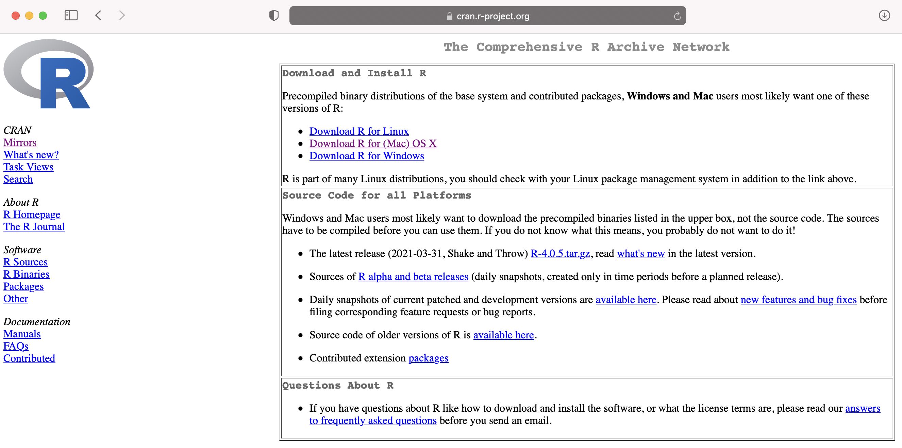
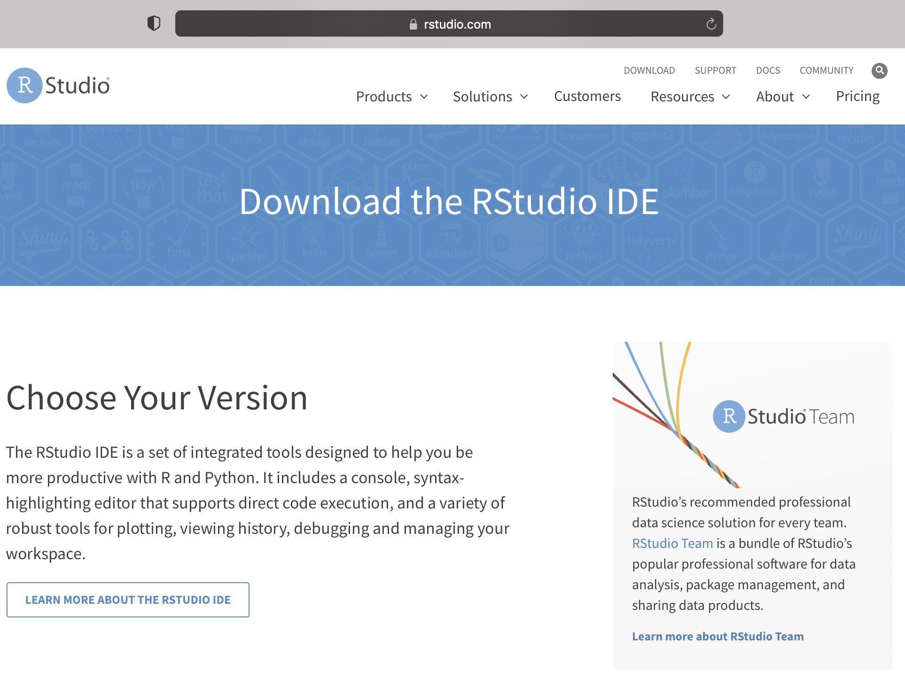
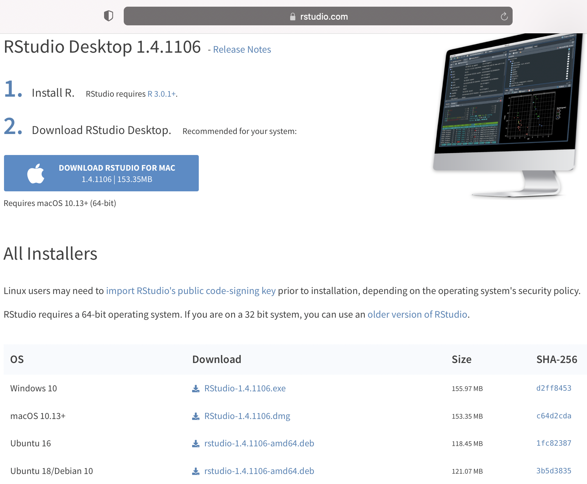
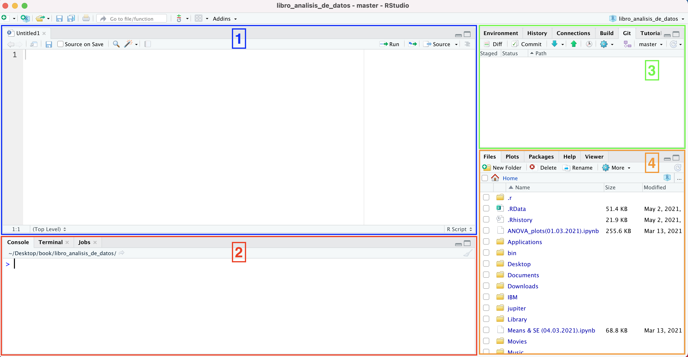
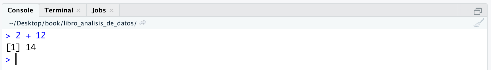
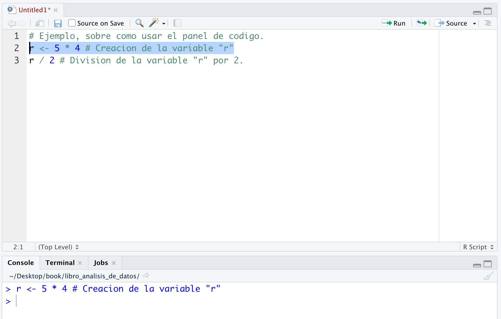
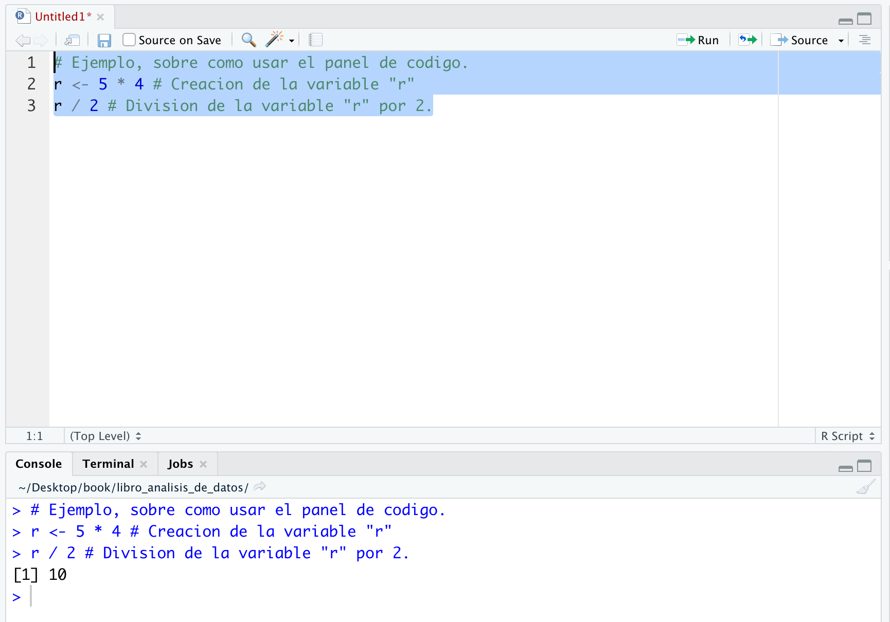
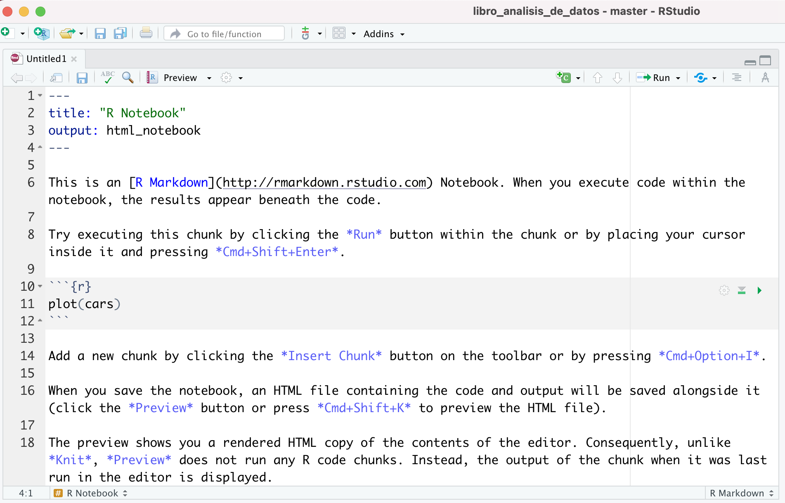
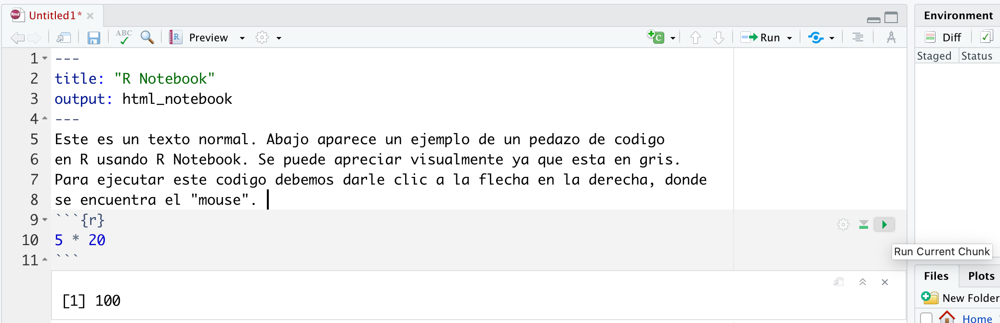

# ¿Qué es R? Instalando R y RStudio {#chapter_3}

## Definiendo R
R es un lenguaje de programación que fue lanzado de manera estable el año 2000 por Robert Gentleman y Ross Ihaka (1993) del Departamento de Estadística de la Universidad de Auckland (Nueva Zelanda). Para esto, ellos se basaron en el lenguaje de programación S desarrollado en los laboratorios Bell de Estados Unidos en 1970. R fue diseñado con el fin exclusivo de construir un lenguaje para el análisis estadístico. De acuerdo al *TIOBE programming community index* (marzo de 2021), R ocupa el puesto 11 entre los lenguajes de programación más populares, toda una sorpresa para una herramienta que fue pensada solo para propósitos estadísticos. 

R es un lenguaje de programación orientado a objetos. ¿Pero qué quiere decir esto? Para mantener las cosas simples, diremos que este tipo de lenguajes permite definir tipos de datos y, al mismo tiempo, definir operaciones que se aplican a estos mismos tipos de datos. Por ejemplo, desde un punto de vista estadístico, podemos definir un objeto como una variable `x = 16` y cada vez que ejecutemos `x`, R imprimirá `16`. También podremos ejecutar algunas funciones sobre la variable o el objeto que acabamos de crear. Por ejemplo, si escribimos en R `sqrt(x)`, nos devolverá la raíz cuadrada de 16 que es `4`, y cuyo valor está almacenado en `x`. `sqrt()` es una función base (es decir, que ya existe) en R que entrega la raíz cuadrada de un valor o variable que esté dentro del paréntesis. De este modo, no tenemos que estar escribiendo de maneras engorrosas la raíz cuadrada y podemos aplicar estas funciones en las variables ya definidas. ¡R lo hace mas fácil para nosotros!

Habiendo definido brevemente R, ahora nos enfocaremos en instalar R en nuestro computador. Luego de esto, pasaremos rápidamente a la descarga de RStudio, el cual es el entorno de desarrollo integrado más popular y casi por definición para interactuar con R y el que usaremos a lo largo de este curso. Nos detendremos un poco en describir RStudio, para describir sus principales paneles y diálogos. Por ahora vamos a instalar R.
 

## Instalando R

Para esto debemos ir a la siguiente website:
 

```{block, type='FOO'}
[Sitio web de R](http://cran.r-project.org/){target="_blank"}
```

```{=html}
<p align="center">
  
</p>
<p align="center">
Figura 3. Página web de inicio de R. 
</p>
```


En la parte superior, aparecerá un cuadro con tres opciones diferentes de descarga según el sistema operativo que use tu computador (i.e., Windows, OS X o Linux). Dale clic a la opción que corresponda a tu caso. 

### R para Windows

A pesar de que la página de R no es particularmente “estética”, puedes fácilmente visualizar y clicar la opción de descarga para Windows. Una vez hayas seleccionado este enlace, dale clic a “install R for the first time”. Esto te llevará finalmente a la página de descarga donde tienes que clicar el enlace que dice “Download R 4.0.5 for Windows (85 megabytes, 32/64 bit)” (o cual sea la versión que veas al momento de descargar R). Esto iniciará la descarga de un archivo, el cual tardará unos pocos minutos dependiendo de tu conexión a internet y otras variables. Ya descargado, haz doble clic para instalarlo y responde apropiadamente las preguntas que haga Windows para su instalación y ubicación. Seguir las opciones por defecto por lo general es una buena idea. Ahora ya teniendo instalado R en tu computador, puedes ir al menú de inicio y abrirlo.

### R para Mac

Si tienes un ordenador Mac, dale clic al enlace correspondiente a Mac OS X. Esto te llevará a una página donde aparece la opción “R for Mac OS X”. Bajo el subtítulo “Latest release:”, encontrarás un enlace con la versión que necesitas (al momento de escribir este texto, yo vi el siguiente link: “R-4.0.5.pkg (notarized and signed)”). Como resultado tu empezarás a descargar el instalador que en mi caso decía “R-4.0.5.pkg”. Sigue el proceso normal de instalación de Mac para instalar R. 

### R para Linux
Para este caso, debo decir que nunca he instalado un programa en Linux, por lo que no soy de mucha ayuda aquí (sorry guys!) y voy a dar una explicación que he encontrado en la web. Deberías darle clic en el enlace “Download R for Linux”. En esa página, tu encontrarás directorios para Debian, Red Hat, Suse y Ubuntu cada una con sus respectivas instrucciones. Una vez que tengas instalado R, puedes correrlo desde la línea de comando tan solo escribiendo `R`. 

## Instalando RStudio

Ahora que ya tenemos R en nuestro computador es bueno recordar que R es un lenguaje de programación. Digo esto porque nosotros podemos interactuar con R de diferentes maneras. Una forma es interactuar con R a través de la consola que está instalada en nuestros laptops. Y para serles brutamente honesto, esta no es la manera más eficiente de hacerlo. En cambio, lo que les propongo es usar un *software* libre para dicho propósito. Es aquí cuando empezamos a hablar de RStudio, el cual es un programa diseñado para hacer nuestras vidas más fáciles cuando interactuemos con R. Si bien hay diferentes herramientas para comunicarse con R, RStudio es por masacre la manera más popular de hacerlo y que, prácticamente, se ha convertido en LA forma de hacer análisis de datos. RStudio es lo que se conoce como un entorno de desarrollo integrado (*Integrated Development Environment*, IDE). Para seguir con las explicaciones simples y que nos permitan seguir avanzando sin mayores problemas con nuestro curso, diremos que un IDE es un software especializado que ha sido pensado para proporcionar las herramientas necesarias para un desarrollo ágil y que cuenta con elementos como un editor, una consola, funciones de autocompletado y resaltado de sintaxis, entre otras funciones. Si bien esto aun puede parecer algo complicado, no se preocupen, en la medida que vayamos avanzando en este curso iremos ilustrando los puntos de la definición. Por ahora lo que haremos es descargar RStudio en nuestro computador. Para esto, utilizaremos el siguiente enlace: 


```{block, type='FOO'}
[Sitio web de RStudio](https://www.rstudio.com/products/rstudio/download/#download){target="_blank"}
```

```{=html}
<p align="center">
  
</p>
<p align="center">
Figura 4. Página web de inicio de RStudio. 
</p>
```

Si bajas un poco a lo largo de la página web de RStudio, te encontrarás con las opciones que aparecen en la figura 5. En este caso, aparece la opción de descarga de RStudio para el sistema operativo de Mac (en el cuadro azul a la izquierda de la imagen *Download RStudio for Mac*) porque la página web de RStudio genera automáticamente el link que cada usuario necesita. Si tienes *Windows*, aparecerá un link para tu sistema operativo. 

```{=html}
<p align="center">
  
</p>
<p align="center">
Figura 5. Links de descarga de RStudio para tu sistema operativo. 
</p>
```

## Explorando RStudio {#capiulo3_4}

Haciendo un breve resumen de lo que hemos hecho en este capítulo, acabamos de descargar dos cosas: el lenguaje de programación R y RStudio. Recalco esto porque algunos usuarios nóveles tienden a descargar solo uno de ellos y no lo dos. Para este curso es necesario tener ambos. 

OK, una vez descargado RStudio en nuestro computador, procederemos a seleccionarlo y abrirlo. Una vez abierto, deberían ver una pantalla similar a la que se muestra en la figura 6. En ella, aprovecharemos de describir los principales 4 paneles que allí se observan (en algunas ocasiones es necesario hacer aparecer el panel [1] *script*, para esto dar clic en la parte superior izquierda en *File* →*New file* → *RScript*).   

```{=html}
<p align="center">
  
</p>
<p align="center">
Figura 6. Paneles principales de RStudio. 
</p>
```

En la figura 6, hay cuatros rectángulos de diferentes colores, los cuales describen los siguientes paneles:

* Panel 1: Panel de Código (*Script*)
* Panel 2: Panel de Consola (*Console*)
* Panel 3: Panel de Entorno (*Environment*)
* Panel 4: Panel de Archivos (*Files*)

A continuación, describiremos de forma muy general estos paneles y en la medida que vayamos avanzando en el curso, procederemos a profundizar más en sus opciones y funciones. El panel de código [1] es uno de los elementos fundamentales de RStudio, ya que en él podemos escribir extensas líneas de comando (en caso de que lo necesitemos), guardarlas y ejecutarlas. Además, tiene herramientas que destaca diferentes porciones de código según la función que cumpla y tiene también funciones de autocompletado. Probablemente, este es el panel que más utilizaremos en la medida que vayamos avanzando con el curso y con las diferentes necesidades de análisis de datos que tengamos. 

En la consola [2] podemos interactuar o escribir directamente instrucciones para comunicarnos con R, y éste nos entrega de forma inmediata las salidas o resultados del código. También imprime las instrucciones ejecutadas en el panel de *script*. 

En el panel [3] o de entorno existen un número de pestañas con diferentes funcionalidades. Por ahora, diremos que en este panel podemos encontrar las variables creadas en algunos de los otros dos paneles descritos o revisar el histórico de instrucciones ejecutadas en R. El panel de archivos de R [4], básicamente funciona como un explorador de carpetas, de este modo podemos crear, modificar, eliminar capetas o archivos sin la necesidad de salir de R.

## La Consola y el Panel de Código (*script*)

Ilustraremos brevemente el uso del panel de código o *script* y la consola de R. Primero partiremos con la consola, ya que es más intuitivo e interactivo su uso. En la figura 7, hay una captura de una operación simple en la consola: aparece la instrucción o *input* `2 + 12`, a la cual simplemente le damos *enter*, y obtenemos el resultado `14`. 

```{=html}
<p align="center">
  
</p>
<p align="center">
Figura 7. Instrucciones en la consola de R. 
</p>
```

Una de las ventajas de usar la consola es que ingresamos un *input* y de forma instantánea obtenemos un *output* en la consola.  Este modo de trabajo se denomina *programación interactiva* y es una forma de programación que hace que el usuario pueda observar los resultados del código que va desarrollando en la medida que lo va creando. En términos de aprendizaje, es bastante útil porque el usuario produce resultados en R, percibe cierto control del proceso de programación y se genera un ciclo de refuerzo continuo que podría incrementar su motivación y subir su percepción de autoeficacia (al menos cuando las instrucciones funcionan).

Sin embargo, si bien la consola es un buen lugar para empezar nuestra aventura a través de la programación por los recovecos de R, al poco andar no será la forma más eficiente de interactuar con R. Por ejemplo, si quisiéramos editar más de dos líneas de código en la consola, el proceso sería algo más engorroso. Para hacer esto (y mucho más), tenemos a nuestra disposición el panel de código. En la figura 8 abajo, hay un ejemplo con tres líneas de código. En la línea 1, recordando lo ya dicho en el capítulo 2, el signo gato o "hashgtag" marca el inicio de los comentarios que queramos escribir para describir lo que hace el código. Pero de forma más importante, todo lo que esté escrito en la parte derecha del `#` será ignorado por R y no será ejecutado, por lo que la línea 1 del ejemplo no es ejecutada. En la línea 2, hemos creado la variable `r` (ver [Capítulo 4](#chapter_4.3.1) subsección 4.3 para más detalles) y en la línea 3 hemos dividido la variable `r` por 2. 

```{=html}
<p align="center">
  
</p>
<p align="center">
Figura 8. Ejemplo de instrucciones en el panel de código de R. 
</p>
```
Un elemento importante del ejemplo de la figura 8 es que la línea 2 ha sido seleccionada (marcando el texto deseado como en el ejemplo, o simplemente dejando el cursor al inicio de la línea de código que se desea ejecutar), y posteriormente, ejecutada. La ejecución de una línea de código se puede hacer al menos de dos maneras: `Ctrl + Enter` (en Windows), `Cmd + Enter` (en Mac) o dando clic en “Run”→ “Run Selected line(s)”. El resultado se observa en la parte inferior, en el panel de la consola "r <- 5 * 4 # Creacion de la variable 'r'".  Lo que es importante notar de este ejemplo es que es necesario seleccionar la línea o líneas de código que se desean correr en R. Arriba solo se corrió la línea 2. Ahora bien, si queremos correr la línea 2 y línea 3 del panel de código, debemos seleccionar ambas líneas y luego ejecutarlas, como lo muestra la figura 9.  

```{=html}
<p align="center">
  
</p>
<p align="center">
Figura 9. Segundo ejemplo de instrucciones en el panel de código de R. 
</p>
```

## Presentando R Notebook

Ahora me gustaría hablar de otra forma de realizar análisis de datos y que ha ganado mucha fuerza durante el último tiempo, más allá del uso de la consola o del *script*. Esta forma de interactuar con R se llama *R Notebook*. R Notebook es un documento de *R Markdown* (es decir, un tipo de formato de documentos dinámicos en R), en el cual puedes digitar texto normal e insertar porciones de código que pueden ser ejecutados independiente e interactivamente, con una salida que se observa inmediatamente debajo del código ejecutado o entrada. En la Figura 10 aparece un ejemplo de R Markdown. 

```{=html}
<p align="center">
  
</p>
<p align="center">
Figura 10. Ejemplo de un R Notebook. 
</p>
```

Hay dos maneras de crear un R Notebook. La forma más sencilla de crear uno es ir y dar clic en *File* →*New file* → *R Notebook* (El producto de esta acción se muestra en la Figura 10); la segunda es algo un “poco” más elaborada, es decir, usando una salida de notebook de html. En las líneas 1 a 4 de la figura 9, muestra un ejemplo de cómo generar un notebook con un tipo de escritura en html, al igual que el código que aparece abajo (nótese que éste debe estar escrito al inicio del *script*):

```{r eval=FALSE}
---
title: "R Notebook"
output: html_notebook
---
```

### Insertando y Ejecutando Porciones de Código

Las porciones de código pueden ser insertadas usando los atajos del teclado según el sistema operativo que tengas. Si estas usando macOS, debes usar `Cmd + Option + I`; y si estas usando Windows, utiliza `Ctrl + Alt + I`. Asimismo, también puedes usar la opción `Insert a new code chunk` para agregar pedazos de código en el R Markdown. La figura 11 muestra un ejemplo de un trozo o pedazo de código desde la línea 9 a la 11, que al ser ejecutado da como resultado `100`:

```{=html}
<p align="center">
  
</p>
<p align="center">
Figura 11. R Chunk o pedazo de código en R. 
</p>
```

Como se puede apreciar en la figura de arriba, en la línea 9 se define el inicio del trozo de código específico (` ```{r}`); en la línea 10, se encuentra la línea de comando que deseamos ejecutar al interior, es decir, `5 * 20`; luego en la línea 11, aparece 3 “*backticks*” seguidos para indicar que allí finaliza el trozo de código. Todo lo que esté más allá de estas líneas no será considerado como parte de ese código particular. Para ejecutar todo lo que está dentro del pedazo de código de R, tenemos que darle clic a la flecha verde al lado derecho de cada *chunk* de código en gris. En la figura 11, aparece una pequeña ventana que dice `Run Current Chunk`. Alternativamente, podemos usar el siguiente atajo con el teclado en Windows ` Ctrl + Shift * Enter ` o el siguiente ` Cmd + Shift + Enter ` si estamos usando macOS. Finalmente, abajo aparece el *output* de nuestro comando: `[1] 100`. 

Cada vez que usemos R Notebooks, es bueno guardar los cambios al igual como si estuviéramos trabajando con un archivo Word común y corriente. De otro modo, todo nuestro progreso no será salvado. 

Se recomienda que cuando el usuario adquiera más experiencia en el manejo de RStudio, pueda trabajar principalmente con los R Notebooks y/o usar la consola de R para probar ciertas instrucciones simples si es que lo desea. 

## Resumen y Ejercicios

En el presente capítulo revisamos cómo instalar el programa de programación R y RStudio. Además, exploramos brevemente RStudio y sus principales paneles, describiendo algunas funcionalidades de la consola, el panel de *script*, y finalizando con una somera descripción de R Notebook.

### Ejercicios

1.	Cree un nuevo R Notebook en RStudio y guarde dicho archivo con el nombre: “ejercicio_1”. 
2.	Borre uno de los guiones en la línea 4 del R Notebook. ¿Qué es lo que sucede?
3.	Elimine todo el texto que aparece de la línea 14 a la línea 18. 
4.	Ejecute el trozo de código que va desde la línea 10 a la 12. ¿Qué es lo que sucede?
5.	Inserte un trozo de código a partir de la línea 14. 
6.	En la línea 15 escriba la siguiente operación: `(23*7)/ 2.5` ¿Cuál es el resultado?

**Las respuestas a todos los ejercicios se encuentran en el [Anexo 2](#anexo_3_7_1).** 
